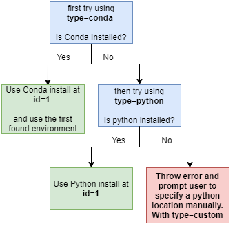

# Python Path Resolution

## Status
PROPOSED

Proposed by: Shams Ul Azeem (15/09/2020)

Discussed with: Adam Gibson, Paul Dubs

## Context
Konduit Serving has the ability to run a python script using a PythonStep. There are a bunch of options that need to be setup for the PythonStep which includes, names and data types for inputs & outputs, script locations, python library paths. All of these options remain static from system to system apart from the python library paths variable. Since, every system has a different set of python installations using either conda, virtual environments or regular python installs, it becomes a hassle to manage a PythonStep configuration that's widely usable across different systems. The point of creating this ADR is to specify a simple enough workflow that can take care of the python library paths resolution for us through both using the konduit-serving cli **profiles** and simple configs. This basically will try to find the python and conda installations through executables found inside the **PATH** environment variable.

## Proposal
The base of the proposal is to be able to assign identification tokens to different python install locations. Instead of knowing and specifying absolute python path locations, the user can just specify the identification token of system found python installs. There is still going to be options available for specifying a custom python install that are not present in system environment **PATH** variable. 

### The `pythonpaths` Command
An example of such a workflow is as follows: 

```shell script
konduit pythonpaths
```  

which will output the python install locations as follows:

```text
-------------------------------------------PYTHON INSTALLS-------------------------------------------
-   id: 1
    path: C:\Program Files (x86)\Microsoft Visual Studio\Shared\Python37_64\python.exe
    version: 3.7.8

-   id: 2
    path: C:\Users\shams\miniconda3\python.exe
    version: 3.7.7

-   id: 3   
    path: C:\Users\shams\AppData\Local\Microsoft\WindowsApps\python.exe                        
    version: 3.6.1
-----------------------------------------------------------------------------------------------------

--------------------------------------------CONDA INSTALLS-------------------------------------------
-   id: 1
    path: C:\Users\shams\miniconda3\Scripts\conda.exe
    version: 4.8.4
    ----------------------------------------ENVIRONMENTS---------------------------------------------
    -   name: base
        path: C:\Users\shams\miniconda3
        version: 3.6.1
    
    -   name: py37
        path: C:\Users\shams\miniconda3\envs\py37
        version: 3.7.7
    
    -   name: py38
        path: C:\Users\shams\miniconda3\envs\py38
        version: 3.8.1
    -------------------------------------------------------------------------------------------------

-   id: 2
    path: C:\Users\shams\miniconda2\Scripts\conda.exe
    version: 4.7.1
    ----------------------------------------ENVIRONMENTS---------------------------------------------
    -   name: base
        path: C:\Users\shams\miniconda2
        version: 2.6.1
    
    -   name: py27
        path: C:\Users\shams\miniconda2\envs\py27
        version: 2.7.7
    
    -   name: py25
        path: C:\Users\shams\miniconda2\envs\py25
        version: 2.5.1
    -------------------------------------------------------------------------------------------------
-----------------------------------------------------------------------------------------------------

-----------------------------------------VIRTUALENV INSTALLS-----------------------------------------
-   id: 1
    path: C:\VirtualEnvs\python37
    version: 3.7.8

-   id: 2
    path: C:\VirtualEnvs\python27
    version: 2.7.1

-   id: 3
    path: C:\VirtualEnvs\python35
    version: 3.5.1
-----------------------------------------------------------------------------------------------------
```

Based on the above info (gained from the command: `konduit pythonpaths`), it's much easier to specify python paths in configuration files (using `type`, `python-path`, `environment` properties):

```json
{
  "@type" : "PYTHON",
  "pythonConfig" : {
    "type": "conda",
    "python-path": "1",
    "environment": "py37", 
    .
    .
    .
  }
}
```

#### Possible Values
- The `type` property will take one of the following values: [`python`, `conda`, `virtualenv`, `custom`]
- `python-path` will have the *id* of the python install for `type==python` or the id of the conda install for `type==conda`. Otherwise, it will contain the absolute path of the python executable file when `type==custom` or the absolute root directory path for `type==virtualenv`.
- `environment` will be looked into if `type==conda` to locate the python installation for a particular conda environment.
                               
### Defaults and Priorities
The defaults for python paths are to be expected in the following way:



### Usage with Profiles
The profiles should be extended to incorporate the python paths settings for running with the `serve` command. The same items names that are used for the PythonStep config are going to be used here. For example: 

```shell script
konduit profile create python_37_env --python-type=conda --python-path=1 --conda-env=py37 <...other_options...>
                                        # OR
konduit profile create python_37_env -pt=conda -pp=1 -ce=py37 <...other_options...>
```

When the above profile is used with the `serve` command, the usage will look like the following:

```shell script
konduit serve -c config.json -id python-server -p python_37_env
```

When the above command is run, all the python paths are automatically updated in the configurations to the values specified in the profile settings. 

### Registering a Python Path
If you needed python or conda installation isn't available inside the **PATH** environment variable, you can register it through the `pythonpaths add` subcommand. For example:

```shell script
konduit pythonpaths add --type=python --path=E:\python37\python.exe
                        # OR
konduit pythonpaths add -t=python -p=E:\python37\python.exe
```

Where `--type` or `-t` can be either `python`, `virtualenv` or `conda`. By running the above command, you will see the following output

```text
Id: 4
Python path at location "E:\python37\python.exe" has been registered.
```

#### Specifying Different Python Paths for Different PythonSteps
If you want to specify different python paths for different PythonSteps and don't want profiles to update your configurations dynamically, then you can specify `python-path-resolution: static` in the particular step configuration and it won't be affected by the profiles settings.
 
### Installed Packages Details
You will also be able to see the installed packages in each python installation with the `with-installed-packages` or `wip` flag. For example:

```shell script
konduit pythonpaths --with-installed-packages
                # OR
konduit pythonpaths -wip
```

The output will look something like: 

```text
-------------------------------------------PYTHON INSTALLS-------------------------------------------
-   id: 1
    path: C:\Program Files (x86)\Microsoft Visual Studio\Shared\Python37_64\python.exe
    version: 3.7.8
    packages: 
        > absl-py | 0.9.0
        > aenum | 2.2.4
        > apipkg | 1.5
        > appdirs | 1.4.3
        > argcomplete | 1.11.1
        > astor | 0.8.1
        > astroid | 2.3.2
        > attrs | 19.3.0
        > autopep8 | 1.5
        > black | 19.10b0
        > bleach | 3.1.4
        > cachetools | 4.0.0
        > certifi | 2020.4.5.2
        > chardet | 3.0.4
        > click | 7.1.2
        > colorama | 0.4.1
        > coverage | 5.0.3
        > cycler | 0.10.0
        > Cython | 0.29.20
        > dbf | 0.99.0
        > dbfpy | 2.3.1
        > decorator | 4.4.2
        > docutils | 0.16
        > execnet | 1.7.1
        > gast | 0.2.2
        > google-auth | 1.12.0
        > google-auth-oauthlib | 0.4.1
        > google-pasta | 0.2.0
        > grpcio | 1.27.2
        > h5py | 2.10.0
        > hurry.filesize | 0.9
        > idna | 2.9
        > imageio-ffmpeg | 0.4.2
        > importlib-metadata | 1.6.1
        > isort | 4.3.21
        > Jinja2 | 2.11.1
        > joblib | 0.14.1
        > jsonschema2popo | 0.12
        > -e git+https://github.com/eclipse/deeplearning4j.git@6b736eae3333a94c1ef22ae5e53b1139434bb4b5#egg=jumpy&subdirectory=jumpy
        > Keras | 2.3.1
        > Keras-Applications | 1.0.8
        > Keras-Preprocessing | 1.1.0
        > keyring | 21.2.0
        > kiwisolver | 1.1.0
        > konduit | 0.1.10
        > lazy-object-proxy | 1.4.2
        > Markdown | 3.2.1
        > MarkupSafe | 1.1.1
        > matplotlib | 3.2.1
        > mccabe | 0.6.1
        > mock | 4.0.1
        > networkx | 1.9
        > numpy @ file:///C:/Users/shams/Downloads/numpy-1.19.1%2Bmkl-cp37-cp37m-win_amd64.whl
        > oauthlib | 3.1.0
        > opencv-python | 4.2.0.32
        > opt-einsum | 3.2.0
        > packaging | 20.4
        > pandas | 0.24.2
        > pathspec | 0.7.0
        > pep8 | 1.7.1
        > Pillow | 7.0.0
        > pkginfo | 1.5.0.1
        > protobuf | 3.11.3
        > py4j | 0.10.7
        > pyarrow | 0.13.0
        > pyasn1 | 0.4.8
        > pyasn1-modules | 0.2.8
        > pycodestyle | 2.5.0
        > pydatavec | 0.1.2
        > pydl4j | 0.1.5
        > Pygments | 2.6.1
        > pyjnius | 1.3.0
        > pylint | 2.4.3
        > pymongo | 3.11.0
        > pyparsing | 2.4.7
        > pyspark | 2.4.5
        > pytest-cache | 1.0
        > pytest-cov | 2.8.1
        > pytest-pep8 | 1.0.6
        > python-dateutil | 2.8.1
        > pytz | 2020.1
        > pywin32-ctypes | 0.2.0
        > PyYAML | 5.3.1
        > readme-renderer | 25.0
        > regex | 2020.2.20
        > requests | 2.24.0
        > requests-oauthlib | 1.3.0
        > requests-toolbelt | 0.9.1
        > rsa | 4.0
        > scikit-learn | 0.22.2.post1
        > scipy | 1.4.1
        > setupext-janitor | 1.1.2
        > six | 1.15.0
        > tensorboard | 2.1.1
        > tensorflow | 2.1.0
        > tensorflow-estimator | 2.1.0
        > termcolor | 1.1.0
        > toml | 0.10.0
        > torch | 1.4.0+cpu
        > torchvision | 0.5.0+cpu
        > tqdm | 4.45.0
        > twine | 3.1.1
        > typed-ast | 1.4.0
        > urllib3 | 1.25.9
        > webencodings | 0.5.1
        > Werkzeug | 1.0.0
        > wrapt | 1.11.2
        > zipp | 3.1.0
.
.
.

-   id: 3   
    path: C:\Users\shams\AppData\Local\Microsoft\WindowsApps\python.exe                        
    version: 3.6.1
    .
    .
    .

-----------------------------------------------------------------------------------------------------

.
.
.

```

### Example Workflow
Here is an example workflow that involves the actual API code snippets:

#### 1. For Regular Python Install
Assuming `konduit pythonpaths`, gives us the following information on a particular system for regular python installs:

```text
konduit-pc ~ % konduit pythonpaths

-------------------------------------------PYTHON INSTALLS-------------------------------------------
.
.
.

-   id: 4
    path: C:\Program Files (x86)\Microsoft Visual Studio\Shared\Python37_64\python.exe
    version: 3.7.8
    packages: 
    .
    .
    .

.
.
.
```

Now we want to specify the python install with `id = 4` into the PythonStep configuration in Java. The code would look similar to: 

```java
PythonConfig pythonConfig = PythonConfig.builder()
        .pythonType(PythonConfig.PythonType.Python)
        .pythonPath("4")
        .build();
```

#### 2. For Conda Install
Assuming `konduit pythonpaths`, gives us the following information on a particular system for conda installs:

```text
konduit-pc ~ % konduit pythonpaths

.
.
.

--------------------------------------------CONDA INSTALLS-------------------------------------------
-   id: 1
    path: C:\Users\shams\miniconda3\Scripts\conda.exe
    version: 4.8.4
    ----------------------------------------ENVIRONMENTS---------------------------------------------
    -   name: base
        path: C:\Users\shams\miniconda3
        version: 3.6.1
    
    -   name: py37
        path: C:\Users\shams\miniconda3\envs\py37
        version: 3.7.7
    
    -   name: py38
        path: C:\Users\shams\miniconda3\envs\py38
        version: 3.8.1
    -------------------------------------------------------------------------------------------------
    
.
.
.
```

Now we want to specify the conda install with `id = 1` and the conda environment `py37` into the PythonStep configuration in Java. The code would look similar to: 

```java
PythonConfig pythonConfig = PythonConfig.builder()
        .pythonType(PythonConfig.PythonType.Conda)
        .pythonPath("1")
        .environment("py37")
        .build();
```

#### 3. For Virtualenv Install
Assuming `konduit pythonpaths`, gives us the following information on a particular system:

```text
konduit-pc ~ % konduit pythonpaths

.
.
.

-----------------------------------------VIRTUALENV INSTALLS-----------------------------------------
-   id: 1
    path: C:\VirtualEnvs\python37
    version: 3.7.8

-   id: 2
    path: C:\VirtualEnvs\python27
    version: 2.7.1

-   id: 3
    path: C:\VirtualEnvs\python35
    version: 3.5.1
-----------------------------------------------------------------------------------------------------
```

Now we want to specify the virtualenv install with `id = 2` into the PythonStep configuration in Java. The code would look similar to: 

```java
PythonConfig pythonConfig = PythonConfig.builder()
        .pythonType(PythonConfig.PythonType.VirtualEnv)
        .pythonPath("2")
        .build();
```

#### 4. For Custom Python Install (Not Registered in `pythonpaths`)
For a python install (assuming that it's installed at location: `D:\python38\python.exe`) that's not registered with the `pythonpaths` command, the Java API code would look similar to: 

```java
PythonConfig pythonConfig = PythonConfig.builder()
        .pythonType(PythonConfig.PythonType.Custom)
        .pythonPath("D:\python38\python.exe")
        .build();
```

### Validation for errors

#### 1. Paths not found
Most of these kinds of error would occur on `custom` python install configuration since the python path might be misspelled. So, an error message similar to the following would work be shown:

```text
Unable to find python path installed at location: `D:\python37\python.exe`. The directory or path doesn't exist.
```

#### 2. Invalid ID for a specific python type
This would happen if an ID that doesn't exist is specified in the configuration. This would show:

```text
Invalid ID "4" specified for Conda install type. Available Conda install IDs are: 

- id: 1
  path: C:\Users\shams\miniconda3\Scripts\conda.exe
  version: 4.8.4

- id: 2
  path: C:\Users\shams\miniconda2\Scripts\conda.exe
  version: 4.7.1
```

Similar messages will be shown for cases when the type is `python`, `virtualenv`.

#### 3. Conda environment not found
This can occur for `conda` install type where a non-existent conda environment is specified. This would show: 

```text
Invalid conda environment "py39" specified for conda installed at location: "C:\Users\shams\miniconda3\Scripts\conda.exe", id: "1". Available environments for the specified conda install are: 

-   name: base
    path: C:\Users\shams\miniconda3
    version: 3.6.1
    
-   name: py37
    path: C:\Users\shams\miniconda3\envs\py37
    version: 3.7.7

-   name: py38
    path: C:\Users\shams\miniconda3\envs\py38
    version: 3.8.1
```

## Consequences 
### Advantages
1. No need to run `python -c "import sys, os; print(os.pathsep.join([path for path in sys.path if path]))"` to find out the python libraries locations, manually. 
2. Profiles will make sure the intended python path is used between system transitions.
  
### Disadvantages
1. Not entirely straightforward in the beginning. Needs documentation...

## Discussion
### With Adam

> Adam 

Maybe add a bit more about the auto discovery? I'd also add a registration command like konduit register path/to/python/binary kind of like what you do in pycharm.

---

> Shams  

Ah yes! The I'll add the details about the auto discovery. Basically it's going to find the python and conda executables in the `PATH` environment variable and then assign their respective IDs. 

Also, the registration command is a good idea. It will register and keep it in the python paths even if it's not inside the **PATH** env variable.

---

> Adam  

Specify a bit about how this will work? Also if we're pointing at a conda environment one thing we might want to do is specify a conda environment to use?

---

> Shams  

Yup the shell command will take care of that. You'll have  an option to specify a conda environment name as well when you put `type == conda` in the config.

so this command has that option here: https://github.com/KonduitAI/konduit-serving/pull/469/files#diff-87058a0e57d0b969b3864dc5a0e0cbe8R136 under `--conda-env` or `-ce` flag

---

> Adam  

Another note might be virtual envs as well. I'm not sure how hard it is, but specifying whether we create a separate virtual env could also be good. Same for running conda. I wonder if we could bootstrap a conda environment from konduit as well. As long as we have access to a python binary we're good to go.

---

> Shams  

Hmm. Virtualenv would more or less have the same workflow so shouldn't be hard to add it here. We basically have a lot of options to do here but most of it is running conda/python/virtualenv commands. There's no problem using the basic few commands for listing packages or versions but using dependencies resolution for python would take a bit more effort here. It's fine for cases where there are no clashes between deps but resolving clashes is gonna be a mess if we try to do it directly from konduit. 

I'll keep bootstrapping new python environments (whether `virtualenv` or `conda`) for a separate PR. For this ADR, I'll just work on specifying pre-installed/created python installs/environments. 

---

> Shams  

I'll keep bootstrapping new python environments (whether `virtualenv` or `conda`) for a separate PR. For this ADR, I'll just work on specifying pre-installed/created python installs/environments. 

---

> Adam  

Could you show a code example as well? It'd be good to see something like pythonPathProfileId(..) as well.

Specify basic validation as well like: "couldn't find path.." etc

---

> Shams  

Sure. I'm calling it location for now for the custom python type where `location=E:\python37\python.exe` could make more sense

I'll add an example end-to-end workflow

I've changed `location` to `python-path` in the examples. They're not exactly end-to-end but they give you the whole workflow idea pretty well.

---

### With Paul

> Paul  

I've got a few questions that came up as I was reading the ADR:
* Why are we using the system python? Can we not ship our own python?
* The way this is supposed to work, binds it pretty hard to the defining system. What if id 1 is a different kind of python on a different system?
* There is a bit of magic in the defaults, all "magic" should be explicitly logging what it is doing, so users can actually know what is happening - or why something doesn't work anymore after they've moved their jar file to a different system
* How does this work with deployment type "jar"?
* Static Setting / different python paths for different steps: How does this work for the "create on one machine, serve on a different one" use case?

Overall, I'm not sure the direction of the PythonStep is what I would expect given the options we have. the cpython bytedeco package can provide us with a known python executable in a known place and it does ship with both pip and venv. On that grounds I'd expect the python step to be able to be aware of a `requirements.txt` file, so it should also be able to set up all necessary libraries in an environment for that python step. 

--- 

> Shams  

Thanks Paul, appreciate the review. I like the suggestion for `venv` for cpython for bootstrapping new environments from a requirements.txt file. I'll answer the queries one by one:

- **Why are we using the system python? Can we not ship our own python?**
We don't have to necessarily use the system available python installation. We have that as an option so it can work without having to add anything extra on top of the konduit installation and a working configuration. If we have a separate python installation script or a zip we can definitely extract that to a particular location and specify its path with `type=custom` & `path=<install_location>` and it should be able to work.

- **The way this is supposed to work, binds it pretty hard to the defining system. What if id 1 is a different kind of python on a different system?**
So, like mentioned in the previous answer, it doesn't have to use the system python. It can use a separate folder where we have the python binaries present in the system. I would consider it as a utility to manage python installations on various locations using different tools. The way it's going to work with different systems is by using profiles that can be setup separately for each system. The only thing that will need to change here is the `serve` command with the right profile. For example: 

```
konduit serve -c config.yaml -id python-server --profile python_profile
```

That way even if the config is transferred from another system the profile will make sure the right python is used even if the configuration is different settings. The profile settings would override what's present in the python step config.

- **There is a bit of magic in the defaults, all "magic" should be explicitly logging what it is doing, so users can actually know what is happening - or why something doesn't work anymore after they've moved their jar file to a different system.**
Yup, every activity is going to be logged while the python step is being initialised so that it's prominent if the right behaviour is being followed. I should demonstrate the workflow in the ADR as well. 

- **How does this work with deployment type "jar"?**
Not sure if I understand this question correctly but if you mean how it would work with a konduit-serving uber-jar then the uber-jar would have all the CLI features so all the commands related to python paths (`pythonpaths`, `pythonpaths add`) would be available through that as well. So, we can simply do something like: `java -jar konduit-serving.jar pythonpaths` and see all the available options there. Also, profiles would be available as well. 

- **Static Setting / different python paths for different steps: How does this work for the "create on one machine, serve on a different one" use case?**
I thought of this for a use case where a user might want to run some python steps on a CPU and some on GPU. For example, I can have a python step that just wants to use tensorflow and another that might wanna use tensorflow-gpu. This would be largely machine specific. So what profiles can do is that they will override the config settings for python paths. Keeping `python-path-resolution: static` would stop it from doing that. The default value of that setting would be `python-path-resolution: dynamic` where profiles would affect the step configuration. 

The cpython venv idea is a good option to have. We can incorporate that in the current workflow by adding a few more types like:

```
{
    type: bootstrap
    requirements: <path-of-requirements.txt>
    path: <path-to-new-venv>
    .
    .
    .
}
```

However, I was thinking of keeping all the installation and validation details with this type of python specification as a separate ADR since there would be a lot of edge cases where the installation fails and how we can deal with that.

---

> Paul  

> I like the suggestion for venv for cpython for bootstrapping new environments from a requirements.txt file.
> If we have a separate python installation script or a zip we can definitely extract that to a particular location and specify its path with type=custom & path=<install_location> and it should be able to work.

I'm not quite sure my point about cpython came across correctly. What I specifically mean is that the following exists:
```xml
<dependency>
  <groupId>org.bytedeco</groupId>
  <artifactId>cpython</artifactId>
  <version>3.7.9-1.5.4</version>
</dependency>
```

The platform specific jar files for it contain a full python installation, along with the standard library. 

The PythonStep is already depending on `org.bytedeco:numpy-platform` and that in turn does depend on the cpython package that I'm talking about.

Now that I've taken a look at the code, I see that the PythonStepRunner is already using PythonExecutioner from datavec, which in turn actually *does* use that package through the Java Interface, and that in turn means that it already uses the internal interpreter. 

I think that the proposal is somewhat misguided given this knowledge. I fully expect things to crash in hard to debug ways, if we are using the bundled python executable with a different set of libraries that at best expect a slightly different standard lib and at worst where compiled for a different python version. 

---

> Shams  

So, based on our call. Javacpp cpython distro has most of the startup packages (venv, pip) that we need to bootstrap compatible environments. In case of system installed packages, we might lead into some cases where the compiled packages or different python versions are just not compatible with the cpython that gets shipped with javacpp.

We can do some validations here and there but the problem isn't fully solved since the interpreter being used is going to be the same in all cases (that comes with javacpp cpython). So, included venv & pip is the safest way to go.

For no/bad internet case. We can have a simple python path (executable) option that can just take a python executable location and run python step with the libraries included in that package. For packages clashes we do have options for appending or excluding libraries path with javacpp packages.

I'll create another ADR that mentions all of these points and then we can decide which direction we should go.
